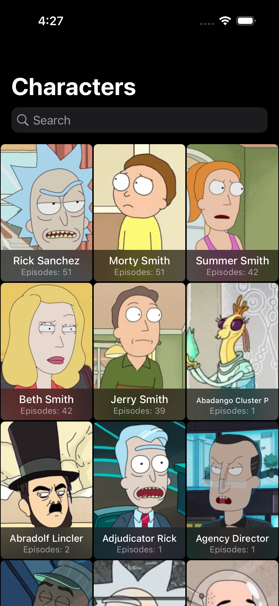
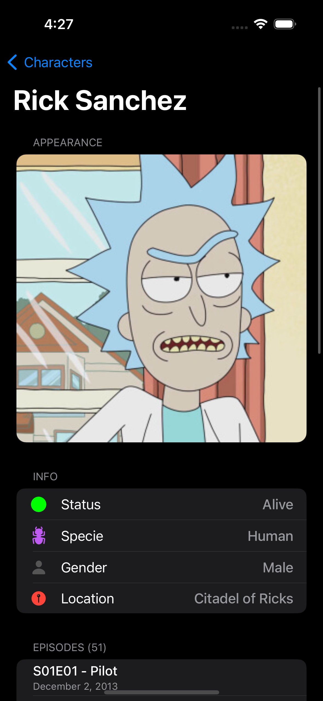
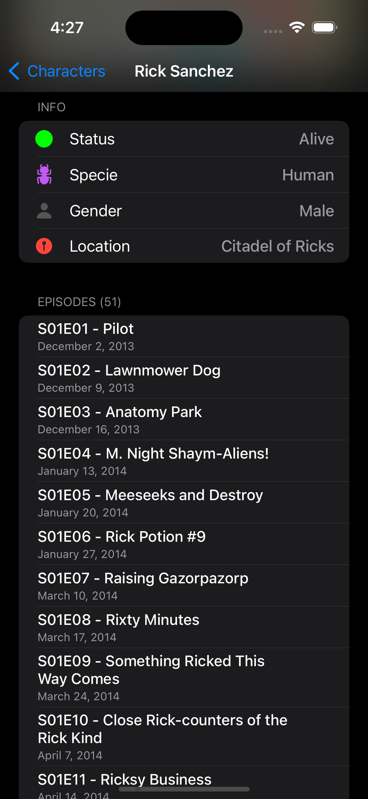

# Rick and Morty

A simple app using the [Rick and Morty API](https://rickandmortyapi.com) written in Swift to display the characters, locations and episodes from the [show](https://en.wikipedia.org/wiki/Rick_and_Morty):

Launch Screen    |     Characters list           |  Character detail    |  Episode detail
:-------------------------:|:-------------------------:|:-------------------------:|:-------------------------:
|||

## Characteristics

- [x] UIKit
- [x] MVVM architecture
- [x] Dependency Injection
- [x] Diffable Data Sources 
- [x] Usage of async/await
- [x] Dispatch Group - Load More - At a time Fetching 20 episodes then load more
- [x] Singleton Design Pattern
- [x] Light and Dark Mode
- [x] Localisation Supported (English, Spanish and French)
- [x] Asynchronous image downloading and caching. (URLSession and NSCache)
- [x] Prefetching images and showing them from the cache to boost your app.
- [x] Extensions for `UIImageView` to directly set an image from a URL.
- [x] Communicate with the API using URLSession (No third party library)
- [x] Fetch All Characters With Pagination.
- [x] Debounce Technique - Filter Character by name
- [x] Fetch All episodes of particular character. 
- [x] Parse JSON Data using Decodable Protocol
- [x] Screen - Character List, Character Detail(Appearance, Info and Episode Lists with load more functionality)
- [x] Memory Management
- [x] No 3rd-party framwork used 

# Summary

- The MVVM Architecture and the well-maintained, reusable code make this app-worthy.
- Filtering and pagination are just two examples of the functionality that ViewModel manages.
- Immediately downloading and caching images With the help of a different class, I created a beautiful ImageView Extension that is simple to use and customise.
- Debounce techniques will improve performance by avoiding the sending of repeated queries.
- We have a Singleton Class that we use to manage API Calling. The CharacterViewModel manages all loader events and logic, including pagination and character name filtering via the debounce method. 
- I use Closure to communicate with View and ViewModel (Data Binding).
- Character Detail ViewModel: I created dependency injection to show character information, and dispatch groups to show lists of episodes.

# Resource
- App Icon Image Sources:
  1. https://wallpapers.com/wallpapers/red-rick-and-morty-silhouette-minimalism-u0vib2avp08tt1dk.html
  2. https://www.facebook.com/photo/?fbid=576263720955692&set=a.576263680955696
- Launch Screen Image Sources:
  1. https://www.imdb.com/title/tt2861424/mediaviewer/rm209331968/?ref_=tt_ov_i
  2. https://m.media-amazon.com/images/M/MV5BZjRjOTFkOTktZWUzMi00YzMyLThkMmYtMjEwNmQyNzliYTNmXkEyXkFqcGdeQXVyNzQ1ODk3MTQ@._V1_FMjpg_UX1000_.jpg
